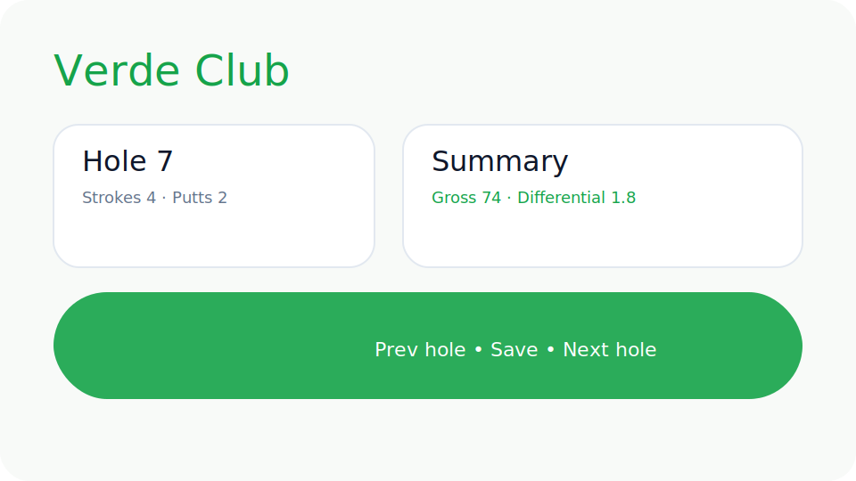

# Golf MVP — Phase-1 (No GPS)

Luxury-first on-course tracking without GPS distances. This mono-repo delivers a React + Tailwind mobile-first client and an Express + SQLite API for ultra-fast hole-by-hole scoring.



## Tech stack

- **Frontend**: React 18 + TypeScript + Vite, Tailwind CSS, Zustand, Vitest
- **Backend**: Express (TypeScript), SQLite via better-sqlite3, Jest
- **Tooling**: ESLint, Prettier, shared npm workspaces, Toast-driven autosave UX

## Features delivered

### Club management
- CRUD for user-claimed distances (e.g., `Driver — 250m`)
- Modal editing with validation, luxury UI, default seed script

### Round scoring
- Mobile-first hole screen with steppers (strokes/putts) + toggle chips (FIR/GIR/In-Play)
- Sticky bottom action bar: Prev • Save • Next
- Instant autosave with success toast feedback
- Keyboard-ready hole navigator, focus rings, and accessible contrast

### Round summary & handicap differential
- Gross + putts totals, FIR/GIR/In-Play percentages, calculated differential `((Gross – CourseRating) × 113) / Slope`
- Hole-by-hole snapshot grid and finish CTA

### Branding & UX highlights
- Primary Verde green `#16A34A`, fog-neutral surfaces, subtle elevation
- Typography: Playfair Display headings + Inter body copy
- Smooth hover/focus motion, white-space heavy layout
- GPS & measured distance stubs ready for future expansion (`services/gps.ts` in both tiers)

## Getting started

```bash
npm install
npm run seed     # optional: seed default club bag
npm run dev      # starts Vite (5173) + API (4000)
```

### Build & quality
```bash
npm run build    # vite build + tsc
npm run lint     # eslint (client + server)
npm run test     # vitest + jest
```

## Project structure
```
.
├── client/          # React + Tailwind single-page app
├── server/          # Express API + SQLite persistence
├── docs/            # Branding previews
└── README.md
```

## API surface

| Method | Endpoint | Description |
| ------ | -------- | ----------- |
| GET    | `/api/clubs` | List clubs |
| POST   | `/api/clubs` | Create club `{ name, claimedDistance }` |
| PUT    | `/api/clubs/:id` | Update club |
| DELETE | `/api/clubs/:id` | Remove club |
| POST   | `/api/rounds` | Start round `{ courseName, courseRating, slope }` |
| GET    | `/api/rounds` | Recent rounds with holes |
| GET    | `/api/rounds/:id` | Fetch round with holes |
| PUT    | `/api/rounds/:id/hole/:holeNumber` | Update hole metrics |
| GET    | `/api/rounds/:id/summary` | Totals, percentages, differential |

_All responses are JSON; errors return `{ message }` with optional validation issues._

## Exclusions & future hooks
- **GPS distance capture**: intentionally stubbed (`services/gps.ts`) awaiting Phase-2 hardware integration.
- **Measured average distances**: not stored yet; architecture keeps clubs minimal for easy expansion.
- **Auth/multi-user**: single-user local focus for MVP.

## Adding GPS later
1. Implement GPS adapters in `server/src/services/gps.ts` and a new persistence module.
2. Extend the round service with measured-distance aggregates, leaving existing schema intact.
3. Surface additional UI metrics in the client via Zustand store extensions and new summary cards.

## License
MIT
